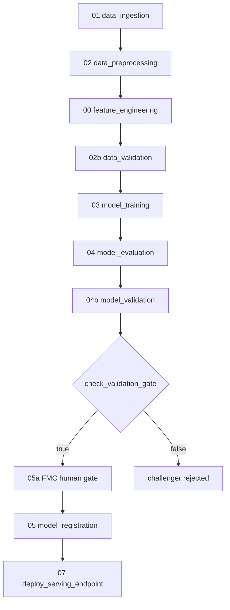
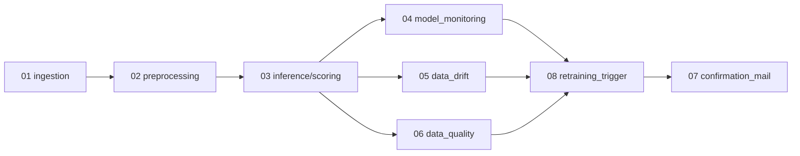
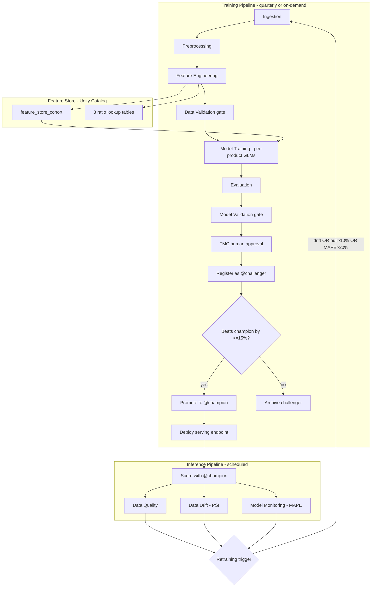

# SCF Cohort Pipeline — End-to-End Walkthrough

How the SCF GLM system works: feature engineering, the feature store, the
training pipeline and its pre-training gates, model training internals, the
champion/challenger lifecycle, and the inference pipeline's data quality,
data drift, and retraining-trigger logic.

---

## 1. Two pipelines, two triggers

| Pipeline | Job | When it runs |
|---|---|---|
| **Training** | `scf_training_pipeline` | Quarterly cron `0 0 3 1 1,4,7,10 ?` (1st of Jan/Apr/Jul/Oct, 03:00 UTC), or manually / via GitHub Actions |
| **Inference** | `scf_inference_pipeline` | Scheduled batch scoring; ends by evaluating whether a retrain is needed |

---

## 2. Feature Store vs Feature Engineering

They are different things:

- **Feature engineering** = the *computation* of model inputs (flow ratios,
  cohort age, rate buckets).
- **Feature Store** = the *Unity Catalog tables* where those computed features
  live, registered via `FeatureEngineeringClient` so UC tracks lineage
  `raw → features → model`.

Feature tables (in the `feature_store` schema):

- `feature_store_cohort` — the cohort feature matrix
- `receipts_ratio_lookup`, `outflows_ratio_lookup`, `transfers_ratio_lookup`
  — the 3 GLM lookup tables

The GLM does **not** predict balances/flows directly — it predicts three
**intermediate flow ratios** that are combined to reconstruct balances and
flows per cohort, then summed to `product × month`.

| Lookup | Ratio | Indexed by |
|---|---|---|
| `receipts_ratio_lookup`  | `rec_prop`                    | cohort age × rate bucket |
| `outflows_ratio_lookup`  | `outflow_prop`                | cohort age × rate bucket |
| `transfers_ratio_lookup` | transfer share (1 − wd_prop)  | rate bucket only |

---

## 3. Training pipeline — full step order

**Before model training runs, gates must pass:**

1. **01 Data Ingestion** — reads the 3 source files from the UC Volume
   (`base_query_df_apr_2026.parquet`, `moneyfacts_merge.parquet`,
   `QRM_products_revised.csv`) into `raw_*` tables. Asserts each landed
   > 0 rows.
2. **02 Data Preprocessing** — builds `silver_agg_cohort`: QRM→best-buy
   mapping, `months_since_start` (cohort age), aggregation to
   `cohort × product × months_since_start`, the three **flow ratios**
   (`rec_prop`, `outflow_prop`, `withdrawal_prop_of_outflow`),
   `delta_to_best_buy` + `dbb_range` rate bucket, and **range checks**
   (`rec_prop ≥ 0`, `outflow_prop ≤ 1`, `withdrawal_prop_of_outflow ∈ [0,1]`).
3. **00 Feature Engineering** — re-validates ratio ranges and builds the 3
   lookup tables.
4. **02b Data Validation** — the hard **pre-training quality gate** on
   `silver_agg_cohort`:
   - required schema columns present
   - row count ≥ `MIN_ROWS` (500)
   - null rate ≤ 5% on feature columns
   - proportion columns within [0, 1]
   - minimum product coverage

   If any hard gate fails → task fails → job-level `on_failure` email →
   **training never runs on bad data.**

---

## 4. Model training internals (step 03)

For **each product** (`03_model_training.py` + `glm_core.py`):

- **3 GLMs** fit per product: `outflow_prop` (Binomial),
  `withdrawal_prop_of_outflow` (Binomial), `rec_prop` (Gamma/Tweedie log).
  ~10 products × 3 GLMs ≈ the "30 models."
- **Hyperparameter grid search** over `month_end × drop_month2`, each trial a
  **nested MLflow run**.
- **Rolling-origin cross-validation** (3 temporal folds) to estimate
  generalisation error.
- **Baseline benchmark** — naive last-value (`balance_lag_1`); the GLM must
  beat it or a warning is logged.
- Best config per product selected by lowest validation MAPE. All product
  tables are pickled to the `model_artifacts` volume (in the `ml_models`
  schema).

---

## 5. Post-training gates → registration

5. **04 Model Evaluation** — portfolio MAPE/RMSE + per-product baseline
   comparison.
6. **04b Model Validation** — description check, MAPE gate vs champion,
   business-metric (projected balance) check, product coverage. Sets
   `validation_passed`.
7. **check_validation_gate** — condition task; only continues if
   `validation_passed == true`.
8. **05a FMC Validation Gate** — human-in-the-loop sign-off (writes PENDING to
   `model_approvals`, notifies, polls up to 24h).
9. **05 Model Registration** — champion/challenger logic (below).
10. **07 Deploy Serving Endpoint** — updates the serving endpoint to champion.

---

## 6. Champion / Challenger lifecycle

Uses **UC Model Registry aliases** (`mlflow_utils.py`):

- `@baseline` — first-ever version
- `@challenger` — the newest candidate (aliased on every training run)
- `@champion` — currently serving production

**Promotion logic** (`evaluate_promotion`), run inside step 05 after human
approval:

- Every training run registers the new model as **@challenger**.
- Compares challenger MAPE vs current champion MAPE.
- Promotes challenger → **@champion** only if it improves by
  ≥ `MAPE_PROMOTION_THRESHOLD` = **15%**.
- **First-ever run** always promotes (no champion to beat).
- If it fails the gate → challenger stays challenger / is archived; champion is
  untouched.

Promotion triggers: **training run → validation passes → FMC approves →
challenger beats champion by ≥ 15% → becomes champion.**

---

## 7. Inference pipeline: data quality + data drift

- **03 Inference** — loads `@champion`, scores per product via
  `applyInPandas`, writes cohort-level `inference_predictions` **and** the
  `inference_predictions_product_month` roll-up.
- **06 Data Quality** — null rates, row-count drop vs expected
  (`ROW_COUNT_DROP_FAIL_THRESHOLD` = 50%), value ranges on the scored batch.
  Records to `data_quality_results`.
- **05 Data Drift** — three PSI-based checks (`PSI_WARN` = 0.1,
  `PSI_ALERT` = 0.25) against a **frozen training-time reference snapshot**:
  1. **Input/covariate drift** P(X) on `int_rate, best_buy,
     delta_to_best_buy, tenure_months, #accounts`
  2. **Prediction/output drift** P(Ŷ) on `balance_pred, rec_pct_pred, …`
     — the *leading* signal, since actuals lag months
  3. **Extrapolation guard** — flags when > `EXTRAPOLATION_ALERT_RATE` (5%)
     of the batch has `delta_to_best_buy` outside the GLM's training support
  
  Emails **only when drift is detected**; sets `drift_detected`.
- **04 Model Monitoring** — per-product MAPE aggregated to portfolio MAPE;
  sets `portfolio_mape_monitoring`, `max_null_rate`.

---

## 8. Retraining trigger — when it fires

**08 Retraining Trigger** combines monitoring + drift signals via
`evaluate_retraining_need`. It recommends a retrain if **any** of:

- `drift_detected == true`, **or**
- `max_null_rate > RETRAIN_NULL_RATE_THRESHOLD` (10%), **or**
- `portfolio_mape > RETRAIN_MAPE_THRESHOLD` (20%)

If recommended → sets `retrain_recommended=true` and sends a webhook/email. It
**does not auto-run** training — a human or external orchestrator kicks off
`scf_training_pipeline`, which produces a new challenger and repeats the cycle.

---

## 9. Combined end-to-end loop

**In one line:** quarterly (or drift-triggered) **train → challenger →
data/model gates → FMC approval → beat champion by 15% → champion → serve →
monitor drift/quality/MAPE → recommend retrain → repeat.**

---

## Key thresholds (`src/common/config.py`)

| Threshold | Value | Used for |
|---|---|---|
| `PSI_WARN_THRESHOLD` | 0.10 | Drift warning |
| `PSI_ALERT_THRESHOLD` | 0.25 | Drift alert |
| `MAPE_PROMOTION_THRESHOLD` | 15.0% | Challenger → champion promotion |
| `NULL_RATE_FAIL_THRESHOLD` | 0.05 | Pre-training validation |
| `ROW_COUNT_DROP_FAIL_THRESHOLD` | 0.50 | Inference data quality |
| `RETRAIN_NULL_RATE_THRESHOLD` | 0.10 | Retraining trigger |
| `RETRAIN_MAPE_THRESHOLD` | 20.0% | Retraining trigger |
| `EXTRAPOLATION_ALERT_RATE` | 0.05 | GLM extrapolation guard |
